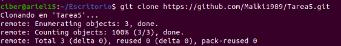
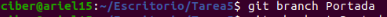
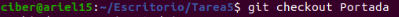
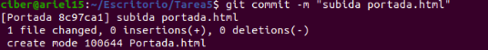
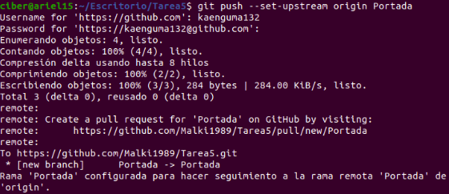
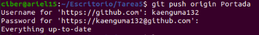
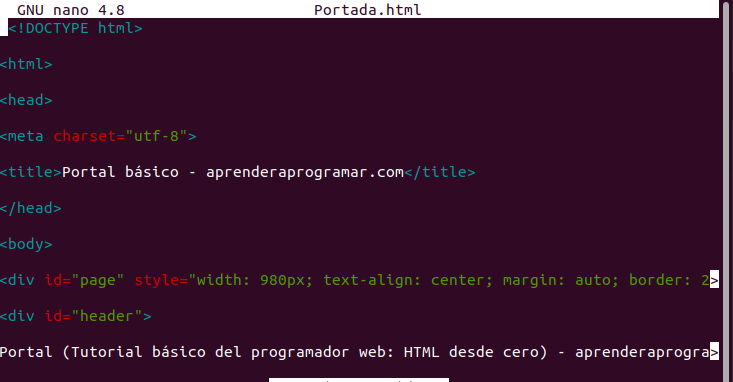
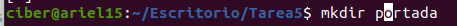
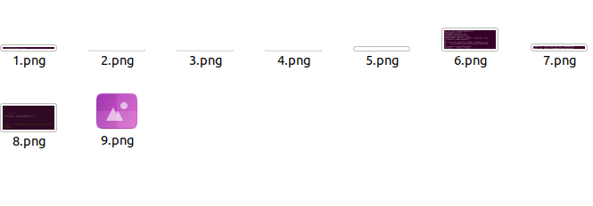

# Tarea5

## Pasos a realizar una subida a una rama "Portada" de Github 
- Usando el comando git clone https://github.com/Malki1989/Tarea5.git y entramos en la caprpeta con el comando cd Tarea5
- Ahora creamos una nueva Rama que se va llamar Portada  con el comando **git branch portada**
- Nos ubicams en la nueva rama que hemos creado con el comando **git checkout**
- Una vez dentro crearemos con el comando sudo **touch / nano /vi** y lo llamaremos Portada.html 
- Para añadir el archivo al proyecto tenemos que usar el comando **git add Portada.html** 
- Volvemos a hacer un **git status** y vemos que se ha sincronizado correctamente si aparece en verde
- Ahora pasamos a registrar cambios en el historial con el comando **git commit -m "Comentario que queramos poner** y vemos que se ha realizado correctamente 
- Ahora toca subir el archivo a gitlab a traves del comando **git push --set  upstream origin Portada** 
- Ahora tenemos que hacer 4 comit mas en este caso sera la modificacion del README.md subida de varias imagenens y creacion de carpeta donde se guarda las imagenes 
- El primero sera la modificaccion del archivo portada.html poniendo una estructura basica de  una pagina  html 
- Creamos la carpeta portada para las imagenes 
- Colocamos las imagenes detro de esa carpeta 
-

